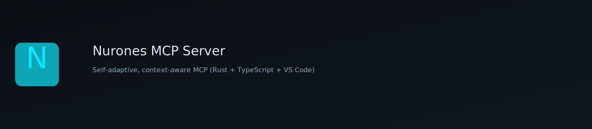

<p align="center">
  
</p>

<h3 align="center">🧠 Nurones MCP Server</h3>
<p align="center">Self-adaptive, context-aware Model Context Protocol (MCP) server — <b>Rust core</b> · <b>TypeScript SDK</b> · <b>VS Code extension</b>.</p>

<p align="center">
  <a href="https://github.com/nurones/nurones-mcp/actions/workflows/ci.yml"></a>
  <a href="https://github.com/nurones/nurones-mcp/actions/workflows/bench.yml"></a>
  <a href="LICENSE"></a>
  
</p>

---

## 🚀 Quick Start
```bash
git clone https://github.com/nurones/nurones-mcp.git
cd nurones-mcp
./quickstart.sh
```

VS Code: open `/vscode-extension`, `npm i && npm run build`, then press <kbd>Ctrl</kbd>+<kbd>Shift</kbd>+<kbd>P</kbd> → "Nurones MCP".

## 🧩 Architecture

| Layer                  | Tech         | Purpose                                 |
| ---------------------- | ------------ | --------------------------------------- |
| **mcp-core/**          | Rust (Tokio) | Event bus, ContextFrame, WASI tools     |
| **sdk-node/**          | TypeScript   | Contracts, schemas, integration helpers |
| **vscode-extension/**  | TypeScript   | Primary host (developer UX)             |
| **qoder-integration/** | JSON         | Secondary host integration              |
| **admin-web/**         | React/Next   | Telemetry + governance                  |
| **.mcp/**              | JSON         | Config + tool manifests                 |

## 💡 Highlights

* Context-aware routing with safety bounds (±10%/day)
* WASI tool execution (fs.read / fs.write examples)
* OpenTelemetry + Prometheus out of the box
* CI/CD + CodeQL + Release workflows
* MIT licensed

## 📚 Docs

* **Quick Start:** [docs/QUICKSTART.md](docs/QUICKSTART.md)
* **Architecture:** [docs/ARCHITECTURE.md](docs/ARCHITECTURE.md)
* **Contributing:** [docs/CONTRIBUTING.md](docs/CONTRIBUTING.md)
* **Releases:** [docs/RELEASES.md](docs/RELEASES.md)
* **Phase notes (archive):** [docs/archive/](docs/archive/)

## 🌍 Community

Open a Discussion or an Issue with your use case / ideas. PRs welcome!

MIT © 2025 Nurones
